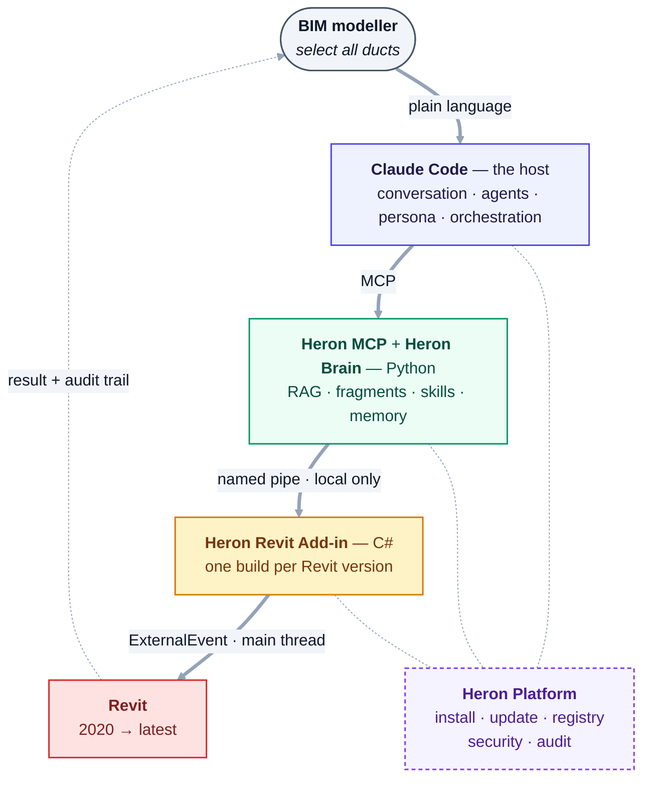
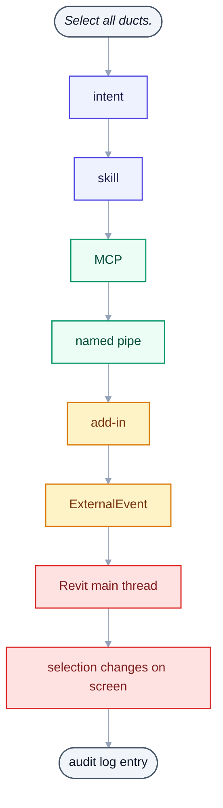

# Heron AI

> **Dear Modelers — please do not install this yet.**
>
> This repo is public only so the work is open. It is still not finished.
> Let me complete everything first. I will announce it on LinkedIn and on the
> website when it is ready to install.
>
> Until then, feel free to read and follow along.
>
> **Programmers and AI engineers — your thoughts are very welcome.**
> Please read the code and share your suggestions, ideas or corrections
> through an Issue or a Discussion. That help is what I am asking for now,
> not installs.

**A modular, agent-based AI engineering platform for BIM.**

> The user focuses on BIM. Heron AI focuses on everything behind the BIM work.

---

## What it is

Heron AI lets a BIM Modeler, BIM Coordinator or engineer drive complex Revit automation by describing
the work in ordinary language:

```
"Select all ducts."
"Move them 200 mm up."
"Add end caps."
"Check this model against our BIM standard."
```

Behind that sentence, Heron performs the analysis, knowledge retrieval, code generation, validation,
testing, execution, logging and learning. The user never has to know C#, the Revit API, MCP, RAG,
vector databases, build systems or version compatibility.

It is **not** a chatbot, a coding assistant, or a plain MCP server.

## Four parts

| Part | Responsibility |
|---|---|
| **Heron Revit** | The add-in, ribbon, and everything touching the Revit API |
| **Heron MCP** | The controlled bridge between the AI layer and Revit |
| **Heron Brain** | Skills, fragments, RAG, memory, knowledge |
| **Heron Platform** | Install, update, packages, registry, security, GitHub |

---

## Status

**Phase 0 is complete — Steps 1 to 5, all proven in real Revit 2020 and 2024.**

**Phase 1 is BUILT AND UNPROVEN, and Phase 2 is built and barely proven — those are different words
on purpose.** The C# —
the write path, and the fragment bodies — compiles on all eight releases from 2020 to 2027 with zero
warnings. The Python that reasons about it has a suite per subject — derive the count with `ls tests/test_*.py | wc -l` rather than reading one here, and the pass/fail set is **derived, not typed here** — `python tools/check-gaps.py` runs them and separates what genuinely failed from what is only waiting for a machine. **That list used to name five failures, then two, and now names none.** `test_graph`, `test_reachable` and `test_bridge_roundtrip` all pass — the last of those was excused for weeks as needing Windows and Revit and actually needed one `dotnet build`, which nobody had run. **`test_mcp_serves` and `test_served_claims` pass as well, measured 2026-09-19**, and this paragraph said they still failed until that day. They wanted the MCP SDK — but **`pip install mcp` on its own is still the wrong move**: on 2026-09-16 it pulled a `cryptography` whose native bindings raise on import, turning a clean skip into a crash and making both suites *worse*. What actually clears them is `pip install --user mcp` **followed by** `pip install --user --upgrade cryptography cffi`. **CI leaves the SDK out on purpose** and its known-failure list is unchanged, so a green suite here is about your container, not the build. A test that cannot run says so and exits distinctly; that is the behaviour to keep. A compiler proves the
API surface agrees; a test proves the logic agrees with itself; neither says whether a duct moves 200
millimetres or 200 feet.

**Until 2026-09-06 this paragraph went on to say none of it had ever loaded into Revit and no fragment
had met a model. Both have now happened.** The add-in is deployed in Revit 2024 and D-28's executor
compiles a fragment's C# inside Revit's own process against the assemblies Revit has actually loaded.
**329 of the 395 fragments are `PROVEN` as of 2026-09-19** — each on a recorded proof against a named
model, with a negative case and a staleness fingerprint ([D-30](docs/DECISIONS.md)). **The other 79 have
still never met a model**, and twenty-three of those were written on 2026-09-18 to close recorded gaps,
so they are new rather than neglected.

**Do not trust those two numbers — derive them.** They move hourly while a proving session runs, and this
line read *"16 of 349"* for two days after neither half was true:

```bash
grep -h '^heron-status:' brain/fragments/*/fragment.yaml | sort | uniq -c
```
[`NEEDS-CHECKING.md`](docs/NEEDS-CHECKING.md) carries that debt item by item, and
`python tools/check-gaps.py` prints what is genuinely unfinished versus what is only waiting on a
machine.

| | |
|---|---|
| Specification | ✅ Complete in 4 parts — [platform](docs/00-master-specification.md) · [Agent OS](docs/00b-master-specification-agent-os.md) · [baseline](docs/00c-master-handover-baseline.md) · [additional requirements](docs/00d-additional-requirements.md) |
| Architecture review | ✅ Complete — [gaps, ideas, tensions](docs/PROPOSALS.md) across all four parts |
| Constitution | ✅ **Accepted 2026-08-28** — all [30 Articles](HERON_CONSTITUTION.md), confirmed after every one was read out rather than tapped through. Reading them aloud found three stale statements inside |
| **Waiting on the owner** | **[FOR-THE-OWNER.md](docs/FOR-THE-OWNER.md)** — one page, and it holds no list: `python tools/owner-queue.py` derives one from the registers at the moment you ask |
| Open questions | **56 answered · 1 open** — **the last four were answered by the owner on 2026-09-20**, asked back to him one at a time in plain words with a worked example each, after the first attempt at all four together was dismissed twice. `Q-51` → carried text gets a **stamp, not a scanner** ([D-81](docs/DECISIONS.md)): Heron attributes rather than asserts. `Q-54` → **the cloud line is drawn by content type, not by scope** ([D-82](docs/DECISIONS.md)) — **all documents may go, models and families never** — which supersedes D-24's framing at his explicit request. `Q-55` → he went **further than the question offered** ([D-83](docs/DECISIONS.md)): not a count and a clause number but the **prior practice by name**, *"in Project A you used 700mm, do you want the same here?"* `Q-56` → the cheapest honest answer ([D-84](docs/DECISIONS.md)): **nothing more than today, and the word "sandbox" goes.**  **ONE REOPENED 2026-09-19 AS [Q-57](docs/OPEN-QUESTIONS.md)**: may a fragment or skill that WRITES declare a question? Ten fragments and five skills do today ([row 158](docs/FRAGMENT-ISSUES.md)), and **some of them are probably right** - so the rule is genuinely undecided rather than broken, and nothing in the golden rules or the decisions covers it. **Nothing gates any phase** — [OPEN-QUESTIONS.md](docs/OPEN-QUESTIONS.md) |
| Licence & safety files | ✅ Complete — Apache 2.0, security policy, disclaimer, contribution guide |
| Roadmap | ✅ Drafted — [Phase 0 → 7](docs/ROADMAP.md) |
| Step 1 — the bridge | ✅ **Proven.** One button connects and disconnects, per-session token, newest connection takes the pipe. Two Revits at once, each with its own pipe. **Since Step 6 a lease decides who may actually send anything** ([D-22](docs/DECISIONS.md)) — taking the pipe is no longer taking the right to use it, and that half is unproven |
| Step 2 — the thread hop | ✅ **Proven.** `5,844 elements in Project1` from Revit 2024, `3,167` from 2020 — and a clean *"Revit is busy"* instead of a hang |
| Step 3 — the MCP server | ✅ **Proven.** *"is Revit working?"* answered inside Claude Code from both live Revits, no command run |
| Step 4 — the first BIM answer | ✅ **Proven.** *"select all ducts"* — 4 found and highlighted on screen in both Revits, plus the audit trail |
| Step 5 — more than one Revit | ✅ **Proven.** Refused to guess between two, took "1", and **stopped** when that Revit closed rather than using the other |
| ⛔ **Phase 0 ends here** | Everything above is **read-only**. Nothing can change a model |
| Step 6 — the first write | ⚠️ **Built and compiled. Never run.** The rails came first as the [build order](docs/27-build-order.md) requires — one `TransactionGroup`, preview, re-count, document pinning, permission gate, emergency stop, then the move. The chat half is tested, and a compiler has now read every line on **all eight releases, zero warnings** — which cost one 2020-only defect to discover. It has still **never loaded into Revit and has never moved anything.** Writing stays off until it has ([D-19](docs/DECISIONS.md), [`NEEDS-CHECKING.md`](docs/NEEDS-CHECKING.md)) |
| ⛔ **Phase 1 ends here, unproven** | `write.enabled` defaults to **`false`** and stays there until a real Revit has been through the register. Heron can no longer be read-only by construction, so it is read-only by default instead — a real weakening, made deliberately and written down rather than smoothed over |
| Steps 7–14 — Phase 2 | ✅ **Built in full, and almost none of it proven.** The fragment store, one knowledge store per scope, exact-word search, local offline embeddings, the two fused behind a hard Revit-version filter, the capability registry, the dependency graph, and ten skills that name capabilities rather than fragments. **All ten skills are `DRAFT`. 66 of the 395 fragments are `DRAFT` and 329 are `PROVEN` as of 2026-09-19** — derive both with the `grep` above rather than reading them here — a fragment re-authored from an earlier library arrives here unproven whatever it was there ([D-44](docs/DECISIONS.md)), and that rule is enforced in code rather than remembered |
| The brain, reachable | ✅ Three read-only MCP tools resolve a request through a **capability**, never a fragment id. **Resolving is not running** — and nothing could run a fragment at all until D-28's executor landed on 2026-09-06. It runs one **READ-ONLY**: it opens no transaction, so Revit itself refuses any model change. Running a fragment that WRITES **is a separate operation, and it now exists** — `run_fragment_write`, `MODIFY` in the registry, wrapping the run in a `TransactionGroup` that is assimilated only on `apply=true` and rolled back otherwise, so a preview is the run itself undone ([D-55](docs/DECISIONS.md)). **168 `MODIFY` fragments are `PROVEN`**, so that path has met a real model. `write.enabled` still defaults to `false` |

| Running a fragment cannot end Revit | ✅ **Proved in front of Revit 2026-09-16.** A fragment is C# compiled and run inside Revit's own process, so a runaway recursion in one used to take **Revit and the unsaved model with it** - `StackOverflowException` cannot be caught, and .NET fails the process fast. `HeronStackGuard` rewrites a fragment before compiling so the overflow arrives as an ordinary catchable exception instead. A fragment recursing with no floor now comes back as a finding - *"Insufficient stack to continue executing the program safely"* - with Revit still running ([J9](docs/NEEDS-CHECKING.md), [row 104](docs/FRAGMENT-ISSUES.md)). **91 of the 395 fragments carry the guard**, which is every one that could reach it; the rewriting is checked over the whole library by `tests/Heron.StackGuard.TestHost` |
| Heron's own files cannot be half-written | ✅ **Fixed 2026-09-16, unproven by anything but reading.** The config and the bridge discovery file were written by deleting the old one and moving the new one into place, which leaves a window with **no file at all** - and the config loader answers a missing file with defaults, silently, then writes those defaults back. The file whose own header reads *"Owned by you"* was the one that could disappear. Both now go through one atomic write ([row 105](docs/FRAGMENT-ISSUES.md)) |
| Reading a model, beyond counting it | ✅ **Built 2026-09-14 to 2026-09-16. None of it has ever run.** Five read-only tools that answer the same shape of question — **a number about a model is only a number about the part of it you asked for.** `revit_links` (elements inside a LINK are not in the host document), `revit_phases` (a count is a fact about a model AND a phase AND a design option), `revit_systems` (an MEP element **connected to nothing** is on no system and missing from every total downstream), `revit_parameters` (a check that reads only the INSTANCE reports a confident zero on data sitting on the TYPE) and `revit_groups` (an element inside a GROUP carries your edit into every placement of it, and Revit raises no error). **Each is built READ-FIRST** — the register marks those rows `MODIFY`, which that column defines as the highest permission the row *can* require, and reading requires none of it. They compile on all eight releases; Groups L, M, N, P and S in [`NEEDS-CHECKING.md`](docs/NEEDS-CHECKING.md) are what would prove them |

**What is proven and what is only built are different things.**
[HANDOVER.md](docs/HANDOVER.md) §3 keeps that distinction honest, item by item.

### Decided

| | |
|---|---|
| **Host** | Claude Code plugin — skills, subagents, MCP server, Revit add-in |
| **Revit support** | **2020 → latest**, and every future release |
| **Languages** | C# for everything touching Revit · Python for the brain and RAG |
| **Transport** | Named pipes — add-in is the server, local-only by construction |
| **Revit threading** | One `ExternalEvent`, one request queue, one handler |
| **MCP tools** | Thick and specific, one per fragment, each with its own risk level |
| **Generated code** | Hybrid — scripting sandbox while testing, compiled C# for production |
| **Licence** | Apache 2.0 |
| **Distribution** | Free and **open source** on public GitHub; Autodesk App Store later, also free |
| **Building on** | the owner's earlier brain and Revit-connector work, upgraded to this architecture |

### How it fits together



**Solid arrows are the live request path.** Dotted is what comes back, and what Heron Platform
holds up underneath — it installs, updates and secures the other three rather than sitting in the
call chain.

<details>
<summary>Same thing as plain text</summary>

```text
Claude Code           host: conversation, agents, persona, orchestration
     |  MCP
Heron MCP Server      Python — brain, RAG, fragments, skills, memory
     |  named pipe
Heron Revit Add-in    C# — one build per Revit version
     |  ExternalEvent
Revit

Heron Platform        install, update, registry, security, audit — under all three
```

</details>

---

## Picking this up

| If you are… | Start at |
|---|---|
| **the owner, or continuing work** | [**HANDOVER.md**](docs/HANDOVER.md) — what exists, what is proven versus merely built, the five things that will bite you, and what is waiting on a decision |
| **an AI agent** | [**AGENTS.md**](AGENTS.md) — short, and the only file written for you |
| **a developer** | [**docs/PROJECT-MAP.md**](docs/PROJECT-MAP.md) — which folder owns what, where to start a change, which source wins |
| **a BIM modeller** | [01 — Vision & Principles](docs/01-vision-and-principles.md), then the Status section above. Reading a model is proven far more widely than changing one — **145 `READ` fragments are `PROVEN` against 168 `MODIFY`**, and `write.enabled` still defaults to `false` |
| **a BIM manager** | [16 — Version Support](docs/16-version-support-strategy.md) and [12 — Security & Permissions](docs/12-security-and-permissions.md). **Declared support and tested releases are different lists** |

Full routes, with what to read at each stop: [**PROJECT-MAP §E**](docs/PROJECT-MAP.md#e-routes-by-role).

## Documentation

Full index: **[docs/README.md](docs/README.md)**

**Read first:**

- [**AGENTS.md**](AGENTS.md) — rules and reading order for an AI agent
- [**Project Map**](docs/PROJECT-MAP.md) — folders, entry points, change routes, truth hierarchy
- [Vision & Principles](docs/01-vision-and-principles.md) — what this is and why
- [Master Specification](docs/00-master-specification.md) — the complete original spec
- [Proposals](docs/PROPOSALS.md) — what is missing, what is risky, what to add
- [Open Questions](docs/OPEN-QUESTIONS.md) — what must be decided
- [Roadmap](docs/ROADMAP.md) — what gets built, in what order
- [**Build Order**](docs/27-build-order.md) — **the six numbered steps to actually start**
- [**Agent Registry**](docs/28-agent-registry.md) — all 250 agents, what each one does
- [tools/](tools/README.md) — scripts that verify links and derive every count from source
- [Golden Rules](docs/14-golden-rules.md) — the non-negotiables

---

## The Golden Rules

1. User focuses on BIM. Heron handles technical complexity.
2. One agent should have one primary responsibility.
3. Reuse proven knowledge before creating new knowledge.
4. Never break a working Revit version unnecessarily.
5. Personal knowledge must remain separate from company knowledge.
6. Experimental knowledge must remain separate from production knowledge.
7. One agent creates; another agent validates.
8. Background work must not interfere with user work.
9. High-risk actions require controlled approval.
10. Every important object must have identity, version and lifecycle.
11. Vector DB is an index, not the canonical source of truth.
12. No automatic external publishing of private knowledge.
13. No uncontrolled self-modification of production architecture.
14. Every important autonomous operation must be auditable.
15. The platform must be modular enough that agents, skills and fragments can be replaced without redesigning the system.

*(There are **21**, not 15. Rules 16–21 were **accepted on 2026-08-28** and are official and binding on the same footing as 1–15 — undo, preview-before-modify, sandboxing generated code, no permission escalation from untrusted text, plus two learned in the field: **bind the document not just the session** and **a preview expires**. [docs/14](docs/14-golden-rules.md) is the list.)*

> **This line said *"six more are proposed"* until 2026-09-09 — eight days after they stopped being proposals, in the file a new reader opens first.** It was found while reconciling [`HERON_AI_MASTER_ARCHITECTURE.md`](HERON_AI_MASTER_ARCHITECTURE.md), by an entry that used it as a source and got the answer wrong ([32 §4.4](docs/32-master-architecture-reconciliation.md)). `tools/check-docs.py` verifies that every `Golden Rule N` reference points at a rule that **exists**; nothing checks a sentence *about* their status.

---

## First milestone

Phase 0 is one thin vertical slice through every layer:



<details>
<summary>Same thing as plain text</summary>

```text
"Select all ducts."  ->  intent  ->  skill  ->  MCP  ->  named pipe
  ->  add-in  ->  ExternalEvent  ->  Revit main thread
  ->  selection changes on screen  ->  audit log entry
```

</details>

No RAG, no fragments, no installer, no code generation. Just proof that the bridge works —
which settles the remaining blocking questions with facts instead of opinion.

---

## Thanks — what was studied, and the rule that governs it

Heron is built by people who read other people's work. **[D-25](docs/DECISIONS.md) is the rule:
studied and re-authored, never imported.** No code, no dependency and no name is taken from any
project below — what is taken is the *thinking*, rewritten in Heron's own shape, and every capability
starts at `DRAFT` here whatever status it held where it was read.

**Sixteen repositories were read at file level and written up in
[33 — External repository research](docs/33-external-repository-research.md), with what each one
became in [34 — The patterns behind them](docs/34-patterns-adapted.md)** — including the ones that
were **measured and rejected**, because a rejection with a number saves the next person a week.

Named here because something in Heron is different for having read them:

| | For |
|---|---|
| [jamwithai](https://github.com/jamwithai) — `observable-job-agent`, `production-agentic-rag-course` | A way to check a generated claim against its source that **calls no model at all** — and *"the human applies, the agent never submits"*, which this repository had reached independently as [D-30](docs/DECISIONS.md) |
| [Anthropic — Contextual Retrieval](https://www.anthropic.com/engineering/contextual-retrieval) | The observation that a chunk is embedded having lost its document. For a numbered standard, its heading path answers it for free |
| [LightRAG](https://github.com/HKUDS/LightRAG) · [RAGFlow](https://github.com/infiniflow/ragflow) | Read and **not adopted** — both need servers Heron may not have. RAGFlow's reviewable chunk boundaries stayed |
| [Docling](https://docling.org/) | A local document parser, still an open question rather than a dependency |
| [`sqlite-vec`](https://github.com/asg017/sqlite-vec) | The one that made [D-23](docs/DECISIONS.md) possible — vector search in a single file, with no server to install |

**Where a project's licence forbade reading its source, its source was not read** — that is recorded
per row in [33](docs/33-external-repository-research.md), not assumed.

---

## A note on this repository

**It is public.** This paragraph said *"it is still private"* while the banner at the top of this same
file said the repository was public — a reader met both claims in one document, and the wrong one was
at the bottom where it looked like the considered answer. Corrected 2026-09-16.

[D-07](docs/DECISIONS.md) still reads *"has not been done"* for the same reason. That file is
**append-only**, so it is not edited here; the mismatch is logged as **F38** in
[PROPOSALS.md](docs/PROPOSALS.md) for the owner to close.

**What has not changed is the condition that matters most.** Of the four conditions D-07 set, three are
plainly met — the licence is chosen (Apache 2.0, [D-08](docs/DECISIONS.md)), and
[DISCLAIMER.md](DISCLAIMER.md) and [SECURITY.md](SECURITY.md) are written. The fourth is **the
public-code / private-knowledge separation being verified**, and *no record of that verification exists
in this repository*. Publishing is irreversible in practice and client project data must never be able
to reach it, so an unrecorded check is not a passed one.

What is in place by construction: knowledge lives outside the repository entirely, under `%APPDATA%`
or `HERON_KNOWLEDGE` ([`brain/heron_scope.py`](brain/heron_scope.py)), and [D-26](docs/DECISIONS.md)
keeps Revit model files from leaving the machine at all. **That is an argument, not a verification** —
F38 is where somebody writes down having actually looked.
See [17 — Open Source & Distribution](docs/17-open-source-and-distribution.md).

---

**Owner:** Ajmal PS · **Domain:** BIM / Revit engineering automation
