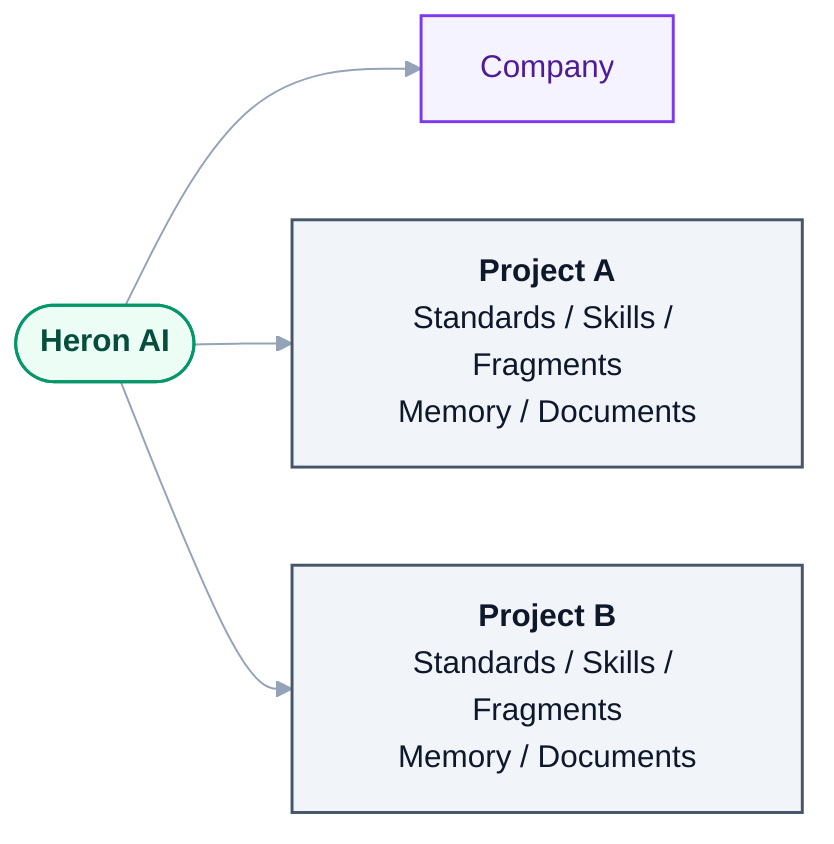

# 10 — Memory & Knowledge Scopes

> Derived from [Master Specification](00-master-specification.md) §15, §28–35, §59.
> **[NOTE]** blocks are engineering commentary added during review.

---

## 1. Memory scopes

| Scope | Contents | Shared with |
|---|---|---|
| **Global / Core** | General Heron knowledge | everyone |
| **Company** | Company standards and approved knowledge | the company |
| **Project** | Project-specific information | that project only |
| **User** | Working preferences, successful personal patterns | nobody, by default |
| **Temporary** | Short-term task context | discarded |
| **Experimental** | Unproven knowledge | quarantined |

> These must never be mixed blindly. — **Golden Rule 5**

## 2. Project context isolation



<details>
<summary>Same thing as plain text</summary>

```text
Heron AI
 |
 +-- Company
 |
 +-- Project A
 |     +-- Standards / Skills / Fragments / Memory / Documents
 |
 +-- Project B
       +-- Standards / Skills / Fragments / Memory / Documents
```

</details>

Project information must not contaminate another project.

**[NOTE — this is a commercial requirement, not just a technical one]** In consultancy and contracting work, Project A and Project B frequently belong to **different clients**, often under NDA. Leakage between them is a contractual breach, not an inconvenience.

Enforce it physically, not by convention:

1. **One database file per scope.** A cross-project query is then impossible by construction, not merely discouraged.
2. **Scope is resolved before retrieval**, from the active Revit document, and is never inferred by a model.
3. **Promotion is always explicit and upward** — Project → Company → Community requires a human decision at each step. There is no automatic path.
4. **Cross-project search requires an explicit, logged opt-in** ("search all my projects"), and the result must show which project each answer came from.

---

## 3. Personal learning (§34)

If a user repeatedly performs a workflow successfully — *"select all ducts and move them 200 mm up"* — Heron may recognise a reusable personal pattern.

> Personal knowledge stays personal by default. It does not automatically become community knowledge.

**[NOTE]** Two guards worth building in:

- **Learn the pattern, not the numbers.** The reusable thing is *select by category → move by vertical offset*, parameterised. Hard-coding "200 mm" produces a brittle, single-use pattern.
- **Confirm before saving a pattern.** *"You've done this 5 times. Save it as a shortcut?"* Silent learning is unsettling; a one-line confirmation converts it into a feature the user feels ownership of.

---

## 4. Community knowledge (§35)

```text
User Knowledge -> Candidate -> Review -> Validation -> Community Proposal
              -> GitHub Pull Request -> Review -> Approved -> Community Knowledge
```

**User approval is required before personal knowledge is submitted externally.**

**[NOTE]** Strengthen this to a hard rule, because a mistake here is unrecoverable:

> **Nothing derived from a client project may leave the machine without explicit, per-item human review of the actual content being sent.**

A fragment carries usage history, failure history, and sometimes literal parameter names, family names or project identifiers. A "generic" duct-selection fragment can easily contain `PROJ-QA-2026-Ashghal-DuctType-A`. Automated sanitisation is not sufficient — a human must see the exact payload. This is `PUBLISH` level, always, no exceptions and no remembered consent.

---

## 5. Knowledge import (§28, §29)

*"Import this folder into Heron."*

Scan → identify file types → identify code → fragments → skills → documentation → metadata → duplicates → compatibility → classify → rename → move into architecture → update metadata → validate → index → save.

**[NOTE]** This is one of the most immediately valuable features in the spec — the user already has years of accumulated Revit tooling (`AJ-Tools`, `PyRevit-Tools`, `AEB-Tools`), and importing it is what makes Heron useful on day one rather than after a year of accumulation.

Design constraints:

1. **Import never modifies the source folder.** Read-only, always. Copy in; never move or rename in place.
2. **Import produces a reviewable manifest**, not a fait accompli: *"Found 47 candidate fragments, 12 look like duplicates of existing knowledge, 6 have unknown Revit compatibility."* The user reviews before anything is committed.
3. **Everything imported starts at `DISCOVERED`.** Nothing arrives as PRODUCTION knowledge — that would violate Golden Rule 6 on the very first day.
4. **Provenance is recorded** — source path, original filename, import date, importing version. When something behaves strangely in six months, this is the only way to find out where it came from.
5. **Import is resumable.** A folder with thousands of files will fail partway through at some point.

Tracked as [Q-16](OPEN-QUESTIONS.md) — which existing repositories are in scope for the first import.

---

## 5a. Reference models — learning the standard from work already delivered

**[NOTE]** Owner's idea, 2026-08-27, and a genuinely new capability none of the four specifications
covers:

> *"You can give the AI a completed work for a reference, so Heron will understand easily."*

Instead of writing the standard out — *duct naming is X, insulation parameter is Y, elevation convention
is Z* — point Heron at a **model already delivered correctly** and say *"do it like this one."*

### Why this is the right instinct

It is how a BIM modeller actually learns. Nobody hands a junior a sixty-page standard; they are told
*"look at how we did Tower A."*

It is also more honest than a written standard. The document says what people **intended**. The
delivered model shows what they **actually did**. When those disagree — and they usually do — the model
is the truth, and it is the truth the next model will be judged against.

And it removes the single biggest barrier to the Standards department ([Part 1 §46](00-master-specification.md))
ever being used: somebody having to sit down and write the standard out first.

### What is extracted

| From the model | Becomes |
|---|---|
| Element, type, view, sheet, level, grid names | Naming conventions |
| Which shared parameters are populated, and with what kinds of values | Required parameter set |
| Family types actually used, and where | Approved family palette |
| Workset names and structure | Workset standard |
| View templates, view naming, sheet numbering | Documentation standard |
| System naming, typical elevations, insulation and connection practice | Modelling conventions |
| Categories used — **and deliberately not used** | Scope of modelling |

A new model is then checked against the profile: *"Tower A uses `MEP-DUCT-SUPPLY-L03`; this model has 47
ducts that do not match that pattern."*

### **Extract the profile, then discard the model**

The most important design decision here, and it solves two problems at once.

1. **Confidentiality.** A reference model belongs to a client. The *pattern* is the user's; the geometry
   and project data are not. Storing only the abstraction is what makes this usable on real project
   work at all — otherwise every reference is a copy of someone's deliverable sitting in the knowledge
   base. This is [Golden Rule 5](14-golden-rules.md) and [12 §4](12-security-and-permissions.md)
   applied to models.
2. **No cross-document constraint.** Once the profile exists, checking a new model against it needs
   nothing else open — no second document, no [§6b](25-multi-session-and-binding.md) trade-off, no
   second Revit. Extraction happens once; the profile is used forever.

A profile is small, human-readable, diffable and reviewable. A model is none of those things.

### Cautions

**A model is evidence, not a standard.** A delivered model also contains mistakes, and Heron must not
learn a mistake as a rule.

| Guard | Rule |
|---|---|
| **Frequency** | Done 400 times in a model, it is a convention. Done once, it is not. Record the count and the proportion, always |
| **Corroboration** | A pattern from one project stays `DISCOVERED`. Seen across several delivered projects, it can progress. See [24](24-trust-model.md) |
| **Human approval** | It **proposes**. Becoming the company standard needs an explicit yes ([Golden Rule 6](14-golden-rules.md)) |
| **Conflict** | A new reference disagreeing with an existing standard is a conflict, not an overwrite — route it to [conflict resolution](20-knowledge-trust-and-conflict.md) |
| **Exceptions are not violations** | Every real model has deliberate exceptions. A profile should record the dominant pattern *and its known exceptions*, or it will flag correct work as wrong |

### Where it fits

The pipeline is the same shape as the code-import pipeline ([Part 1 §28](00-master-specification.md)) —
scan, classify, extract, compare against existing knowledge, deduplicate, propose, approve, index. Only
the input differs: a `.rvt` rather than a folder of source.

Scope: an extracted profile is **Company** or **Project** knowledge, never Global, and it carries its
provenance — which model, which project, when extracted, how many elements it was drawn from.

### Research — what already exists, and where the gap actually is

*Researched 2026-08-27.*

**Extraction is solved.** Revit schedules expose the underlying database; Dynamo exports to Excel; free
tools (RVTSniffer, the Autodesk Interoperability Tools) pull model data out routinely.

**Checking against a standard is solved.** [Autodesk Model Checker for Revit](https://interoperability.autodesk.com/modelcheckerconfigurator.php)
is free for licensed Revit users, validates parameters, data completeness, model structure and
rule-based compliance, and stores its rules as **plain XML checksets** that are editable in a text
editor. Its Configurator gives every filter, check, section and heading a stable **ID**, and it supports
unattended automation. There is a Public Library of shared checksets and a My Library for private ones.

**[buildingSMART IDS](https://technical.buildingsmart.org/projects/information-delivery-specification-ids/)**
became an official standard in **June 2024** — a computer-interpretable XML format for information
requirements, designed for automatic compliance checking. Where ISO 19650 frames *how* information is
managed, IDS is the machine-readable statement of *what* that information must be. IFC-oriented;
1.1 and 2.0 in feedback.

**The gap is the inference.** Every existing tool starts from a standard someone already wrote and
checks a model against it. Going the other way — reading a delivered model and **producing** the
standard — is described in the literature as manual analysis of extracted data.

> Existing tools: *"here is the standard, check the model."*
> **Heron: *"here is a good model, write the standard."***

That is the whole idea, and it appears genuinely unoccupied.

### Design consequence — **infer, then hand off. Do not build a checking engine.**

Heron's profiler should emit its result in formats that already exist:

| Output | For | Why |
|---|---|---|
| **Model Checker checkset XML** | Revit-native checking | Free, already installed at most firms, text-editable, stable IDs, automatable. Heron writes it; the firm can run it **without Heron** |
| **IDS** | IFC / cross-platform, ISO 19650 information requirements | The open standard. Portable to Solibri, ACC, any IDS-capable checker |
| **Heron profile** *(internal)* | Retrieval, conflict detection, conversation | Richer than either — carries frequency counts, exceptions and provenance that neither format expresses |

This is a large and deliberate scope saving. Building a compliance-checking engine would be months of
work competing with mature free tools. **Heron's value is the inference, which nobody does — not the
checking, which is solved.**

It also makes the output honest and portable: a firm can take Heron's checkset, read it, edit it, run it
in their existing pipeline, and keep it if they ever stop using Heron. Knowledge that only works inside
Heron is knowledge the firm does not really own.

**[NOTE]** The internal profile must stay richer than the exported formats. Neither checkset XML nor IDS
expresses *"this pattern held for 1,847 of 1,902 ducts, with 55 known exceptions on Level 3"* — and that
frequency data is exactly what separates a convention from a coincidence, and what
[conflict resolution](20-knowledge-trust-and-conflict.md) needs when two references disagree. Export is
a projection of the profile, never its storage.

**[NOTE]** This is a strong early capability. It is **read-only**, needs no transaction, no `MODIFY`
permission, no code generation and no sandbox — and it makes Heron useful on a firm's real standards
from the first week rather than after months of accumulation. Together with model comparison
([25 §6b](25-multi-session-and-binding.md)) it is probably the highest value-per-unit-of-risk feature
in the whole platform.

---

## 6. Naming and identity

Naming must be predictable and searchable (§31), but identity is an **ID**, never a name (§30). Rename freely; identity survives.

**[NOTE]** Order of operations: **identity first, auto-rename second.** An Auto Rename Agent let loose on a knowledge base that still identifies things by filename will silently destroy the reference graph. The Reference Update Agent exists for exactly this reason and must run in the same transaction as any rename.

---

## 7. **[NOTE]** What "memory" must not become

A caution, from experience with systems of this shape.

An unbounded memory that records everything degrades in a predictable way: it accumulates stale facts, contradicts itself, and retrieval quality falls as the corpus grows. The spec's `Knowledge Evolution Agent` and `stale knowledge detection` acknowledge this, and they should be treated as load-bearing rather than nice-to-have.

Three practical defences:

| Defence | Rule |
|---|---|
| **Expiry** | Temporary memory has a TTL. Project memory is archived when the project closes. |
| **Supersession** | New knowledge that contradicts old knowledge **replaces** it and records the replacement. It does not sit beside it. |
| **Budget** | Each scope has a size budget. Approaching it triggers consolidation, not silent growth. |

The measure of a good memory system is not how much it remembers. It is how reliably it returns the right thing — which usually means remembering **less**, and more deliberately.
