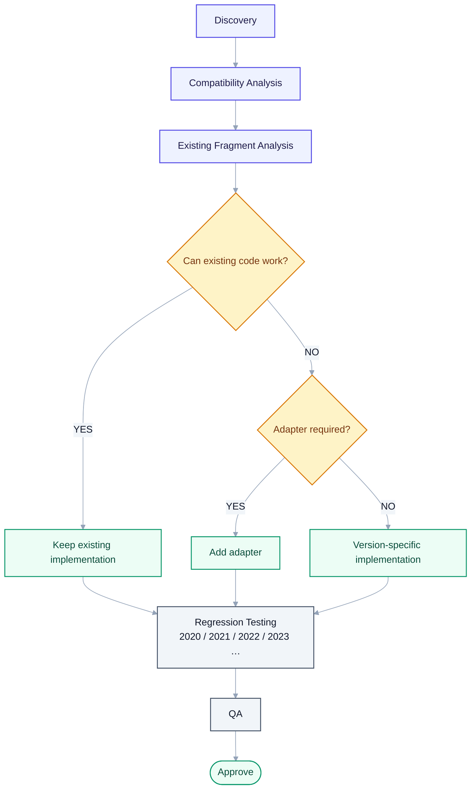

# 11 — Orchestration & Reference Workflows

> Derived from [Master Specification](00-master-specification.md) §48–52, §56, §58, §65–69.
> **[NOTE]** blocks are engineering commentary added during review.

---

## 1. Orchestrator responsibilities

1. Understand request → 2. Identify required capability → 3. Select relevant agents → 4. Build workflow → 5. Execute → 6. Handle failures → 7. Validate result → 8. Return result → 9. Trigger background learning.

The Orchestrator coordinates. It must not become the monolith.

**[NOTE]** The practical discipline: the Orchestrator may know about **capabilities and departments**. It must never know about **ducts, elevations or worksets**. The moment BIM domain knowledge appears in the orchestrator, every future change starts touching it, and it becomes the single file nobody dares edit.

---

## 2. Reference workflow — simple BIM task

User: *"Select all ducts."*

```text
Intent Detection -> BIM Persona -> Task Classification -> Fragment Librarian
-> Existing Fragment Found -> Compatibility Check -> Revit Connection Check
-> Execute -> Validate Selection -> Return Result -> Record Success
```

If an approved fragment exists, **reuse it**. Do not generate code (Golden Rule 3).

**[NOTE]** This is the path that must be fast, because it is 90% of real usage. Target after warm-up: **one T2 call (intent) and nothing else.** Everything downstream — fragment lookup, compatibility filter, execution, validation — is deterministic.

There is a further optimisation worth designing in: an **utterance cache**. The exact string "select all ducts" maps to a known skill after the first time. Subsequent identical requests skip intent detection entirely and cost nothing at all. Cache on normalised utterance + document context, invalidated when the skill changes.

---

## 3. Reference workflow — new tool

User: *"Create a tool that automatically dimensions ducts."*

```text
Requirement -> Librarian -> Existing Skill/Fragment Search -> Architecture
-> Revit API -> .NET -> Code Generation -> Code Review -> Build -> Test
-> Revit Test -> Regression -> QA -> Fragment Creation -> Skill Creation
-> Documentation -> Approval -> Production
```

**[NOTE]** Eighteen stages, several of them T3. This is minutes of work and real cost, and that is appropriate — it is a genuine software delivery pipeline compressed into one request. But two things must be true or it will not be trusted:

1. **The user is told this is the expensive path**, up front: *"This needs a new tool. It'll take a few minutes — I'll build and test it, then show you before anything touches your model."*
2. **`Approval` is a human gate.** The pipeline may reach the door of production autonomously. A person opens it.

The pipeline should also be **resumable**. Failing at the Build stage after twelve stages of work must not discard everything before it.

---

## 4. Reference workflow — knowledge import

```text
Import -> Scan -> Classify -> Extract -> Identify Fragments -> Compare Existing
-> Duplicate Check -> Compatibility Check -> Naming -> Architecture -> Migration
-> Validation -> Index -> Approval -> Save
```

See [10 §5](10-memory-and-knowledge.md) for the constraints — read-only source, reviewable manifest, everything enters at `DISCOVERED`.

---

## 5. Reference workflow — fragment update across versions



<details>
<summary>Same thing as plain text</summary>

```text
Discovery -> Compatibility Analysis -> Existing Fragment Analysis
-> Can existing code work?
     YES -> keep existing implementation
     NO  -> adapter required?
              YES -> add adapter
              NO  -> version-specific implementation
-> Regression Testing (2020 / 2021 / 2022 / 2023 ...) -> QA -> Approve
```

</details>

Existing versions must remain functional. This is Golden Rule 4.

---

## 6. Failure handling (§51)

```text
Task -> Agent A -> FAILED -> Failure Analysis -> Find reason
     -> Select Fix Agent -> Fix -> Re-test -> Validation -> Continue
```

> The system should not blindly retry the same failed action repeatedly.

**[NOTE]** Retry policy, made concrete:

| Failure class | Policy |
|---|---|
| **Transport** (pipe dropped, Revit busy) | Retry with backoff, bounded attempts |
| **Precondition** (no document open, nothing selected) | Do not retry. Tell the user what is missing. |
| **Permission** (element owned by another user) | Do not retry. Report and offer alternatives. |
| **Revit operation genuinely failed** | Do not retry. Send to Failure Analysis. |
| **Generated code failed** | Repair loop, **hard-capped** (suggest 3 attempts), sandbox only |

An unbounded repair loop against a live model is the worst failure mode in the system: it burns money, and each attempt is another chance to damage something. Cap it, then ask the user.

**[NOTE]** Failures are the highest-value training signal in the platform. Every failure should be recorded with enough structure for the Capability Gap Agent to aggregate: what was asked, what was selected, what failed, at which stage, and what the user did next. The single most useful report Heron can produce in month one is *"here are the ten things people asked for that I could not do."*

---

## 7. Background system (§48, §49)

Background work: update checking, dependency checking, vector indexing, re-indexing, duplicate detection, fragment scoring, fragment validation, fragment evolution, memory organisation, knowledge cleanup, agent health, plugin health, MCP health, compatibility checks, backup, log processing, performance analysis, documentation sync.

Scheduler priorities:

```text
P0 — User task
P1 — Required validation
P2 — Required maintenance
P3 — Knowledge improvement
P4 — Optimization
P5 — Cleanup
```

**[NOTE]** Three constraints the scheduler must respect, or background work will make Heron feel slow and get switched off:

1. **Never run P2–P5 while a user task is active.** Revit is single-threaded for API work and the user is already sharing that thread.
2. **Never run heavy background work while Revit is open.** Re-indexing competes for the same machine the user is modelling on. Idle time, or Revit closed, is the right window.
3. **Background work must be cheap.** Anything on a timer that costs money per run will eventually cost a surprising amount. This is another argument for local embeddings ([05 §6](05-heron-brain.md)).

---

## 8. Performance architecture (§56)

Not every agent runs for every request. The Orchestrator selects dynamically.

**[NOTE]** Worth setting explicit budgets now, so regressions are visible:

| Path | Target |
|---|---|
| Cached utterance → known skill | < 500 ms, zero model calls |
| Simple BIM task, warm | < 3 s, one model call |
| Simple BIM task, cold | < 10 s |
| Standards check over a model | minutes, with progress, cancellable |
| New tool creation | minutes, with progress, resumable, human approval |

If "select all ducts" ever takes 30 seconds, the platform has failed at its core promise regardless of how sophisticated the architecture underneath is. The user has a mouse. It is faster.
