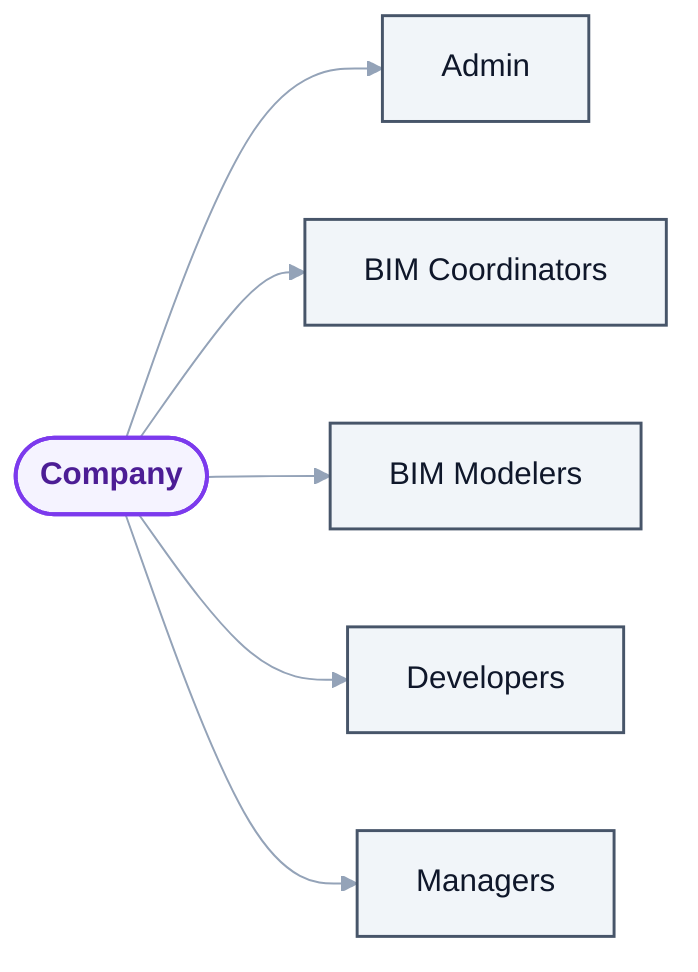
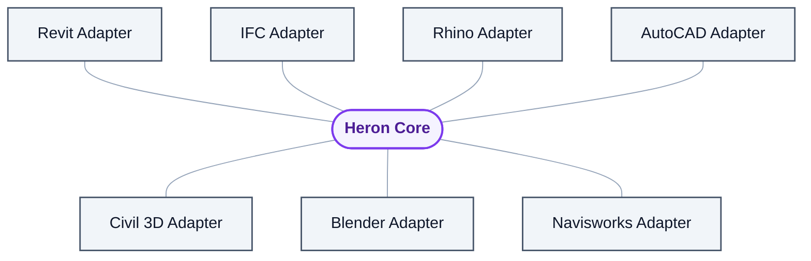

# 22 — Users, Modes & Extensibility

> Derived from [Master Specification Part 2](00b-master-specification-agent-os.md)
> §30–§32, §65–§74.
> **[NOTE]** blocks are engineering commentary added during review.

---

## 1. Conversation intelligence

The conversation layer must recognise what kind of request it is receiving:

| Utterance | Kind | Requires |
|---|---|---|
| *"Why did this fail?"* | debugging | investigation |
| *"Select all ducts."* | command | execution |
| *"Make a tool for this."* | development | full build workflow |
| *"What does this parameter do?"* | asking | retrieval only |
| *"We always dimension from the centreline."* | explaining | record as knowledge |

**[NOTE]** This classification is more useful than it looks, because it determines **cost and risk
before anything else runs**. *"Why did this fail?"* is read-only and cheap. *"Make a tool for this"* is
a 27-step pipeline costing minutes. Getting this classification right is the first branch in
[19 §5](19-context-and-cost.md)'s cost pipeline.

It also determines what Heron should **say back**. A development request deserves *"this will take a
few minutes, I'll show you before it touches your model"*. A command deserves silence and a result.

---

## 2. Role-aware communication

| Persona | Response to the same operation |
|---|---|
| BIM Modeler | *"The ducts are selected."* |
| Developer | *"The Revit selection command completed successfully using the approved selection service."* |

> The underlying system remains the same. Only communication changes.

**[DECIDED 2026-08-28 — [D-27](DECISIONS.md).]** ~~Persona should be inferred as a default, displayed,
and pinnable.~~ **There is no persona.** The warning above was right and it argues further than it went:
if silent switching reads as unreliability, the fix is not to display the guess — it is not to guess.

Heron has **one voice**, and what varies is the **shape of the answer**, read off the **shape of the
request**: a count gets a number, a breakdown gets a schedule-style table, a narrowed set gets the items
with their ids, finished work gets a short close, and two comparable numbers get a picture unasked. That
is deterministic — the same request gets the same shape every time — so it cannot produce the two-answers-
on-two-days problem at all.

The *Developer* row of the table above is really Developer **Mode**, which §3 immediately below requires
to be **granted rather than inferred**. Once that is where it belongs, a persona setting has nothing left
to do.

---

## 3. The three modes

| Mode | Audience | Sees |
|---|---|---|
| **User Mode** | BIM Modeler, Coordinator | The work. Progress. Results. Nothing else. |
| **Developer Mode** | Tool authors, Heron maintainers | Agents, workflows, fragments, skills, RAG, logs, API, versions, dependencies, GitHub, build pipeline |
| **Admin Mode** | Enterprise administrators | User management, permissions, company knowledge, standards, agent policies, update policies, package policies, security, audit logs |

**[NOTE]** Modes are a **permission boundary**, not a display preference. Developer Mode grants access
to the generic execute capability ([D-03](DECISIONS.md)); Admin Mode grants access to configuration,
which is itself a security boundary ([21 §9](21-resilience-and-operations.md)).

That means mode cannot be inferred from conversation. **Persona** may be inferred — it only changes
wording. **Mode** must be granted. Conflating the two would let a user talk their way into `ADMIN`.

---

## 4. **[NOTE — tension with [D-01](DECISIONS.md), needs resolving]** Multi-user and Admin Mode



<details>
<summary>Same thing as plain text</summary>

```text
Company
 +-- Admin
 +-- BIM Coordinators
 +-- BIM Modelers
 +-- Developers
 +-- Managers
```

</details>

Each user has personal memory, permissions and personal skills, while sharing approved company
knowledge, skills and fragments.

**The tension:** Heron runs as a **Claude Code plugin** — a single-user desktop tool. There is no
server, no user directory, no central policy, no way for an admin to enforce anything on someone else's
machine. Sections §72 and §73 describe an enterprise product with a fundamentally different shape.

Three ways forward:

| Option | Shape | Assessment |
|---|---|---|
| **A. Single-user only, defer enterprise** | Personal + project + company scopes exist as **folders**; "company knowledge" is a shared repository each user syncs. No admin enforcement. | Honest for the current stage. Delivers most of the value — a shared company brain — with none of the infrastructure. **Recommended.** |
| **B. Company knowledge as a git repository** | Company standards, approved fragments and skills live in a private repo. Admin = whoever reviews the pull requests. | A natural next step from A. Uses machinery already specified (§38). Enforcement is social and reviewable, not technical. |
| **C. Full enterprise server** | Central service, user directory, enforced policy, server-side audit | A different product. Needs hosting, authentication, licensing and support. Should not be attempted until there are paying enterprise users asking for it. |

**Recommendation: A now, B soon, C only on demand.** Design the **scope model** ([10](10-memory-and-knowledge.md))
so that C remains possible — scopes are already separate stores — but build no server.

**[NOTE]** Option B is worth highlighting because it is genuinely most of what enterprises want. A BIM
manager's real need is *"everyone on my team uses our approved standards and our approved tools"*. A
private repository of company knowledge, pulled by every user's Heron, delivers that. Central
enforcement is a much smaller additional benefit than it sounds, and a much larger cost.

Tracked as [Q-32](OPEN-QUESTIONS.md).

---

## 5. Data isolation

> Clearly separate: User Data · Project Data · Company Data · Community Data · System Data.
> **No accidental cross-contamination.**

**[NOTE]** Part 2 adds **System Data** to Part 1's four scopes, which usefully separates Heron's own
operational state (registries, health, metrics) from anything belonging to a user or a project.

The enforcement position from [10 §2](10-memory-and-knowledge.md) stands and matters more now that the
repository will be public ([D-07](DECISIONS.md)): **one store per scope, physically separate**, so a
cross-scope query is impossible by construction rather than merely discouraged.

Mapped onto the Product / Data / Derived split ([06 §2](06-heron-platform.md)):

| Scope | Class | Lives |
|---|---|---|
| System Data | Product + Derived | install location + cache |
| User Data | Data | user profile |
| Project Data | Data | per-project store |
| Company Data | Data | shared location or private repo |
| Community Data | Product | shipped or downloaded, treated as untrusted until validated |

---

## 6. Multi-platform architecture



<details>
<summary>Same thing as plain text</summary>

```text
Heron Core
 +-- Revit Adapter      +-- IFC Adapter        +-- Rhino Adapter
 +-- AutoCAD Adapter    +-- Civil 3D Adapter   +-- Blender Adapter
 +-- Navisworks Adapter
```

</details>

> The core Brain and Agent OS should not depend directly on Revit.

Standardised capabilities per platform: Element Selection · Document Access · Object Creation ·
Object Modification · Transaction · Export · Validation.

**[NOTE]** This is the same discipline as [01 §8](01-vision-and-principles.md) and
[16 §4](16-version-support-strategy.md), and Part 2 supplies the missing piece: **the standard
capability set**. That list is what an adapter must implement, and it is small enough to be real.

It costs almost nothing now — the core is Python and cannot reference `Autodesk.Revit.*` anyway
([D-06](DECISIONS.md)) — and it is what makes a second platform possible later without a rewrite.

**[NOTE]** The Capability Registry ([18 §2](18-agent-operating-system.md)) is what makes this work in
practice. `SELECT_ELEMENTS_BY_CATEGORY` is a capability; Revit provides one implementation, AutoCAD
another. The Orchestrator never learns which platform it is talking to.

**Still deferred.** Revit must work properly first ([ROADMAP](ROADMAP.md)).

---

## 7. Plugin ecosystem

A plugin can provide agents, skills, fragments, MCP tools, UI and integrations. It declares:
Name · Version · Dependencies · Capabilities · Compatibility · Permissions · Author · Security Status.

**[NOTE]** "Permissions" and "Security Status" in the manifest are the right instincts, but a manifest
is a **claim by the author**, not a fact. A malicious or careless plugin declaring `READ` can still
attempt a `MODIFY` call.

The enforcement must be the same as everywhere else ([12 §3](12-security-and-permissions.md)): the
**add-in** gates by declared tool risk level, and a plugin's declared permissions are an upper bound
Heron enforces, never a statement Heron trusts.

This makes [Q-18](OPEN-QUESTIONS.md) — may community packages contain executable code at all? — the
decisive question for the whole ecosystem. Declarative-only skills and fragments are dramatically safer
than arbitrary plugin code running inside a client's Revit session.

---

## 8. Heron SDK

| SDK | Purpose |
|---|---|
| Agent SDK | Create Heron agents |
| Skill SDK | Create reusable skills |
| Fragment SDK | Create knowledge/action fragments |
| Platform SDK | Create integrations |
| MCP SDK | Create MCP tools |

**[NOTE]** An SDK is a **commitment to API stability**. Publishing one before the internal contracts
have settled means either breaking other people's work repeatedly, or freezing a design that has not
been proven yet.

Recommendation: defer all five until the internal contracts have survived real use. The natural first
one is the **Fragment SDK** — fragments are the smallest, most stable unit, they are what contributors
will actually want to write, and their schema will settle earliest.

Ties directly to the semantic-versioning promises in [17 §8](17-open-source-and-distribution.md).

---

## 9. Personal, company and project memory

| USER: Ajmal | Company | Project A |
|---|---|---|
| Preferences | BIM standards | BIM standards |
| Working style | Naming standards | Revit models |
| Successful workflows | Project standards | Project skills |
| Personal skills | Coding standards | Project fragments |
| Personal fragments | Approved workflows | Project decisions |
| Personal projects | Approved fragments | Project memory |

Personal knowledge does not automatically become company knowledge. Company knowledge outranks
experimental personal knowledge. Project B does not inherit Project A's decisions.

**[NOTE]** Fully covered in [10 — Memory & Knowledge](10-memory-and-knowledge.md). Part 2 adds the
**priority ordering** — see [20 §2](20-knowledge-trust-and-conflict.md) — which is the part that makes
the separation useful rather than merely tidy: it tells retrieval what to do when two scopes both have
an answer.
