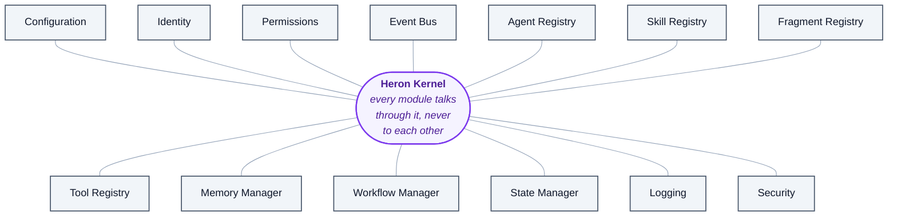

# 23 — Heron Kernel & Workflow Engine

> Derived from [Master Requirements Part 4](00d-additional-requirements.md) §1–§8, §20–§26, §36, §48.
> **[NOTE]** blocks are engineering commentary added during review.
>
> The Kernel is the largest structural addition in Part 4 and the one that most changes how the
> code will be laid out.

---

## 1. The Kernel



<details>
<summary>Same thing as plain text</summary>

```text
Heron Kernel
├── Configuration      ├── Memory Manager
├── Identity           ├── Workflow Manager
├── Permissions        ├── State Manager
├── Event Bus          ├── Logging
├── Agent Registry     └── Security
├── Skill Registry
├── Fragment Registry
└── Tool Registry
```

</details>

> Every module communicates **through the Kernel** instead of directly depending on every other module.

**[NOTE]** This is the right call and it is worth being explicit about why, because "add a kernel" can
easily become "add a god object" — the exact thing [Golden Rule 2](14-golden-rules.md) forbids.

The distinction that keeps it healthy:

| The Kernel **does** | The Kernel **must never** |
|---|---|
| Hold the registries | Know what a duct is |
| Route events | Contain BIM logic |
| Resolve permissions | Contain Revit API code |
| Manage state and checkpoints | Decide *which* fragment is best (that is the RAG layer) |
| Provide identity, config, logging | Perform work itself |

**The Kernel is plumbing, not intelligence.** If a BIM concept ever appears inside it, the boundary has
been crossed. A useful test: the Kernel should compile and pass its tests with **no Revit knowledge
present at all** — which is already required by [D-06](DECISIONS.md), since the Kernel is Python and
cannot reference `Autodesk.Revit.*` anyway.

### Why it matters more than it looks

Without a Kernel, N modules can depend on N other modules — the dependency graph grows quadratically
and "replace the fragment store" eventually means touching thirty files. With one, every module depends
on the Kernel and nothing else. That is what makes [Golden Rule 15](14-golden-rules.md) —
*"agents, skills and fragments can be replaced without redesigning the system"* — achievable rather
than aspirational.

**[NOTE — interaction with [D-01](DECISIONS.md)]** Heron runs as a Claude Code plugin, and Claude Code
already provides conversation, subagent orchestration and tool routing. The Kernel does **not** duplicate
those. It owns what Claude Code has no opinion about: Heron's registries, Heron's permission model,
Heron's state and checkpoints, Heron's event bus and Heron's logging. The two compose cleanly —
Claude Code is the *host*, the Kernel is Heron's *spine*.

---

## 2. The four registries

| Registry | Answers | Detail |
|---|---|---|
| **Capability Registry** | *"What can I currently do?"* | [18 §2](18-agent-operating-system.md) |
| **Agent Registry** | *"Who can do it, and how well?"* | [18 §3](18-agent-operating-system.md) |
| **Skill Registry** | *"What can the user ask for?"* | [09](09-skills-and-fragments.md) |
| **Fragment Registry** | *"How is it actually implemented?"* | [09](09-skills-and-fragments.md) |
| **Tool Registry** | *"What may be called, at what risk level?"* | [04](04-heron-mcp.md) |

**[NOTE]** Part 4 §2's capability entry is worth quoting because it shows all five joining up:

| Field | Value | Resolved by |
|---|---|---|
| Capability | Select Ducts | |
| Provider | Revit Selection Agent | Agent Registry |
| Implementation | Fragment X | Fragment Registry |
| Skill | MEP Selection | Skill Registry |
| Supported | Revit 2020-2027 | |
| Status | PROVEN | lifecycle, see 24 |

One row, five registries, and it answers *"can I do this, with what, how well, on this Revit version?"*
in a single lookup. That lookup is the first step of the cost pipeline in
[19 §5](19-context-and-cost.md) — and it costs no model call at all.

---

## 3. Workflow Engine — separate from the Orchestrator

> The Orchestrator should not manually control every step.

The Workflow Engine manages: sequential tasks · parallel tasks · dependencies · retries · failures ·
approvals · timeouts · rollback · **checkpoints**.

**[NOTE]** Separating these two is a real improvement over the earlier documents, where the Orchestrator
did both. The split is:

| Component | Decides |
|---|---|
| **Orchestrator** | *What* should happen — which capability, which agents, which knowledge |
| **Workflow Engine** | *That it happens correctly* — ordering, retries, timeouts, rollback, resumption |

This is the difference between a plan and a plan's execution. Keeping them apart means the retry logic
is written once, in one place, rather than reinvented inside every multi-step workflow — and it keeps
the Orchestrator thin, which [Golden Rule 2](14-golden-rules.md) requires.

---

## 4. Checkpoints and resume — **the most practically valuable item in Part 4**

```text
Step 1 ✓   Step 2 ✓   Step 3 ✓   Step 4 FAILED
```

> After fixing Step 4: **continue from Step 4**, not restart everything.

**[NOTE]** This matters enormously for the new-tool pipeline, which is 18 stages
([11 §3](11-orchestration-and-workflows.md)). Failing at Build and discarding twelve stages of
completed work is both expensive and demoralising — and it is expensive in *real money*, since several
of those stages are T3 agentic loops.

Requirements for checkpoints to actually work:

1. **Every stage output is persisted**, not held in memory. A Revit crash mid-workflow must not lose it.
2. **Checkpoints are content-addressed** — if an earlier stage's *input* changed, its cached output is
   invalid and the stage re-runs. Otherwise "continue" silently builds on stale work.
3. **Checkpoints are scoped to a Workflow ID** ([21 §13](21-resilience-and-operations.md)), so the audit
   log and the checkpoint store share one key.
4. **A paused workflow is visible.** The user should be able to ask *"what is Heron waiting on?"* and
   get an answer, rather than discovering a task silently died three days ago.

Together with §20 Task Memory, this makes *"Continue."* a first-class command.

---

## 5. Agent communication protocol — extended

Part 4 §4 extends the Part 2 message shape:

| Direction | Fields |
|---|---|
| **In** | Task · Context · Input · Required Output · Constraints · Knowledge · Permissions · **Deadline** |
| **Out** | Status · Result · **Evidence** · Errors · **Confidence** · Changes · **Next Action** |

**[NOTE]** Three of these are new and each earns its place:

- **`Permissions` in, explicitly** — the agent is *told* what it may do, rather than assuming. This is
  §57's least-privilege made concrete, and it pairs with the boundary enforcement in
  [12 §3](12-security-and-permissions.md): the agent is told, *and* the add-in enforces. Belt and braces.
- **`Deadline` in** — makes timeouts a contract term rather than an afterthought. Essential once the
  Workflow Engine owns timeouts.
- **`Evidence` out** — see §6 below. The single best addition in Part 4.

---

## 6. Evidence System — **the best idea in Part 4**

> *"This fragment was selected because it supports Revit 2020–2027 and has 98 successful executions."*

**[NOTE]** This is what turns Heron from a black box into something a professional can actually trust
with a deliverable. A BIM coordinator asked to sign off on a model does not need to see the agent chain
— but they absolutely need to be able to ask *"why did it pick that?"* and get a real answer.

It is also cheap: every field in that sentence already exists in the registries. Evidence is a
**rendering of data Heron already has**, not new machinery.

Evidence should be recorded for: which capability matched · which fragment was chosen and why · which
knowledge scope it came from · what its trust level and success history are · what was rejected and
why · which permission decisions were made.

**[NOTE]** Evidence and Confidence (§5) work together, and the document is right that
**confidence must not replace validation**:

```text
AI confidence + Technical validation + Testing
```

High confidence with no evidence is exactly the failure mode to design against — a model asserting
something plausible with nothing behind it. Requiring evidence alongside confidence makes the assertion
checkable. Recommendation: **for any `MODIFY` operation, an answer with no evidence is refused, not
downgraded.**

---

## 7. Immutable provenance

**Fragment F-001**

| Version | Change |
|---|---|
| v1.0 | Created |
| v1.1 | Revit 2021 fix |
| v1.2 | Revit 2023 support |
| v1.3 | Performance improvement |

> **Never silently overwrite important knowledge.**

**[NOTE]** This is [Golden Rule 4](14-golden-rules.md) and [Golden Rule 10](14-golden-rules.md) applied
to storage. If fragments are stored as files in git ([09 §4](09-skills-and-fragments.md)), most of this
comes free — git *is* an immutable provenance store, and a fragment's history is `git log` over its
folder.

That is a strong argument for the file-based fragment format over a database-only one: provenance,
diffing, review and rollback all arrive without being built.

---

## 8. AI Model Abstraction Layer — **resolves an open tension**

```text
Heron AI Interface -> Model Router -> Provider Adapter -> Model
```

> Do not hard-code Heron around one AI provider.

**[NOTE — this closes [Q-30](OPEN-QUESTIONS.md)]**

The tension recorded in [D-11](DECISIONS.md) was that a Heron-owned Model Router duplicates Claude Code,
which already chooses the model. The abstraction layer resolves it cleanly, because it separates two
things that were conflated:

| Layer | Owner |
|---|---|
| **Heron AI Interface** — *"this task needs strong reasoning"* | Heron. Always. |
| **Provider Adapter** — *"which model, from which provider"* | The host, when hosted; Heron, for its own batch work |

Heron declares **intent**; resolution is pluggable. Under [D-01](DECISIONS.md) Claude Code resolves
conversational work, and Heron's Python side can resolve its own batch work (embedding, classification,
bulk scoring) through the same interface — without either half hard-coding a model id.

This also makes §25's local/cloud routing a configuration choice rather than an architectural one,
which matters directly for the confidentiality question ([Q-12](OPEN-QUESTIONS.md)): a project marked
confidential selects a local provider adapter, and nothing above that layer needs to know.

---

## 9. Prompt / Instruction Registry

> Do not scatter prompts throughout the code.

A controlled registry for system instructions · agent instructions · skill instructions · coding rules ·
BIM language rules — **versioned and tested**.

**[NOTE]** Underrated, and cheap to do from day one. Scattered prompts are the single most common reason
an AI system becomes unmaintainable: behaviour changes and nobody can find which string caused it.

Three properties worth designing in:

1. **Versioned**, so a behaviour change is a diff with an author and a date.
2. **Testable** — each instruction has evaluation cases ([13](13-testing-and-quality.md)), so a
   "small wording improvement" that breaks intent detection is caught.
3. **Composable** — the [Constitution](../HERON_CONSTITUTION.md) rules relevant to an agent are
   assembled into its instructions from one source, rather than copy-pasted into each.

---

## 10. Resource Manager

Monitors CPU · RAM · disk · AI usage · vector DB load · **Revit responsiveness**.

> If Revit is busy, background jobs reduce or pause automatically.

**[NOTE]** Revit responsiveness is the important signal and the least obvious one. Revit is
single-threaded for API work and heavily single-threaded for regeneration; a machine can look idle on
CPU while Revit is unresponsive to the user.

Practical measures: time since last successful `ExternalEvent` execution, and whether a modal dialog is
open. Both are already needed by the health system ([03 §3](03-heron-revit.md)) and by the "Revit is
busy" state ([04 §6](04-heron-mcp.md)). One signal, three consumers.

---

## 11. Feature flags

```text
SmartDimensioning = OFF
ExperimentalRAG   = ON
NewAgentSystem    = TEST
```

**[NOTE]** Feature flags pair naturally with **Shadow Mode** ([18 §4](18-agent-operating-system.md)) and
with **Safe Mode** ([21](21-resilience-and-operations.md)): a flag set to `TEST` is how a shadow-mode
component gets exercised on real requests without its output being used, and Safe Mode is a flag sweep
back to last-known-good.

They are also configuration, and therefore a security boundary
([21 §9](21-resilience-and-operations.md)) — flipping a flag is `ADMIN`, and no text Heron reads may
flip one ([Golden Rule 19](14-golden-rules.md)).
