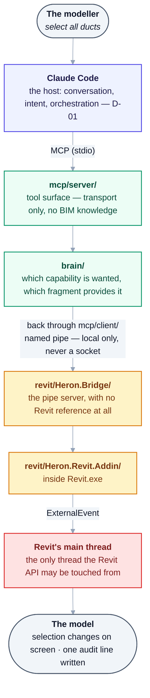

# Project map

**The fastest orientation in this repository.** Which folder owns what, where to start a change, and
which source wins when two disagree.

For *which document covers what*, use [README.md](README.md) — the documentation index. This file maps
**code and folders**, not documents.

---

## A. How a request travels



<details>
<summary>Same thing as plain text</summary>

```text
The modeller                "select all ducts"
   │
Claude Code                 the host: conversation, intent, orchestration   (D-01)
   │  MCP (stdio)
mcp/server/                 tool surface — transport only, no BIM knowledge
   │
brain/                      which capability is wanted, which fragment provides it
   │  back through mcp/client/
   │  named pipe (local only, never a socket)
revit/Heron.Bridge/         the pipe server, with no Revit reference at all
   │
revit/Heron.Revit.Addin/    inside Revit.exe
   │  ExternalEvent
Revit's main thread         the only thread the Revit API may be touched from
   │
The model                   selection changes on screen · one audit line written
```

</details>

Two things this diagram is easy to misread:

- **The host decides what the user meant, not Heron** ([D-01](DECISIONS.md)). Heron resolves a
  *capability*; it never classifies intent.
- **Resolving is not running.** The brain answering *"`select-ducts` provides that"* has changed
  nothing. Running a fragment that **writes** is a separate operation, and `write.enabled` defaults to
  `false`.

---

## B. Folder map

Dependency rules below are not prose — they are enforced by
[`tools/check-structure.py`](../tools/check-structure.py), which fails the build if they are broken.

| | May depend on | Never |
|---|---|---|
| `platform/` | **nothing** | anything |
| `revit/` | `platform` | `brain`, `mcp` |
| `brain/` | `platform` | `revit`, `mcp` |
| `mcp/` | `platform`, `brain` | `revit` |
| `tests/` | all four | — |

`Autodesk.Revit` types may appear **only inside `revit/`**. Anywhere else is a crossed boundary, and
the [`heron-guard`](../.claude/skills/heron-guard/SKILL.md) hook refuses the edit as it is proposed.

### The four product parts

| Folder | Owns | Must not own | Start at | Gate after changing it |
|---|---|---|---|---|
| [`platform/`](../platform/README.md) | Kernel plumbing — paths, config, identity, audit, lease, permissions, emergency stop, units | **Any BIM knowledge.** If a duct is named in here, the boundary is crossed | `Heron.Core/HeronPaths.cs` — the only thing that builds a Heron path | `check-structure.py` · `check-compile.py` |
| [`revit/`](../revit/README.md) | Everything loaded into `Revit.exe` — ribbon, commands, the pipe server, the fragment executor | Network of any kind. Business decisions that could live outside Revit | `Heron.Revit.Addin/HeronApplication.cs` (add-in entry) · `Heron.Bridge/BridgeServer.cs` (the pipe) | `check-compile.py` · `check-api-surface.py` · **a real Revit** |
| [`mcp/`](../mcp/README.md) | Transport between the host and Revit, and the single seam to the brain | BIM logic, knowledge, or any judgement about what the user meant | `server/heron_mcp_server.py` (the MCP entry) · `client/heron_bridge_client.py` (the pipe client) · `server/heron_brain.py` (the **only** door to `brain/`) | `test_mcp_serves.py` · `test_served_claims.py` — both need the MCP SDK |
| [`brain/`](../brain/README.md) | Knowledge — fragments, skills, capabilities, retrieval, context, the graph | Anything that must import a Revit type. It has to stay runnable on a machine with no Revit | `heron_fragment.py` (what a fragment is) · `heron_retrieve.py` (the lookup) · `heron_capability.py` (ask for what you want done) | `heron_fragment.py` · `check-routing.py` · `check-fragments-compile.py` |

### The supporting folders

| Folder | Owns | Start at |
|---|---|---|
| [`tools/`](../tools/README.md) | Every gate, report and generator — the scripts that keep the prose honest | [`tools/README.md`](../tools/README.md), one section per tool |
| [`tests/`](../tests/README.md) | The suites, the golden library, the .NET test host | [`tests/README.md`](../tests/README.md) — **read the exit codes section first** |
| `docs/` | Permanent specification, architecture, decisions and registers | [README.md](README.md) |
| [`docs/work-notes/`](work-notes/README.md) | Temporary operational work — what is going on right now | [work-notes/README.md](work-notes/README.md) |
| `.claude/` | House rules as skills, and four prototype agents. **The only tree of HOUSE RULES** — `brain/skills/` above is Heron's own skills, the jobs it does for a modeller, and the two share a word and nothing else | [`.claude/skills/README.md`](../.claude/skills/README.md) |
| `.codex/` | The same four agents for a second host, pointing at the same skills | `.codex/config.toml` |

---

## C. Change map — where to start

| I need to… | Start here | Then |
|---|---|---|
| Change what happens **inside Revit** | [`revit/README.md`](../revit/README.md) | `revit-addin-conventions` and `revit-ribbon-and-windows` skills. Remember: a loaded assembly cannot be unloaded — every change needs a Revit restart |
| Add or change a **fragment** | [`brain/README.md`](../brain/README.md) → `heron_fragment.py` | [09 — Skills & Fragments](09-skills-and-fragments.md). A re-authored fragment arrives **unproven** whatever it was elsewhere ([D-44](DECISIONS.md)) |
| **Prove** a fragment against a model | [`fragment-proving`](../.claude/skills/fragment-proving/SKILL.md) skill | [NEEDS-CHECKING.md](NEEDS-CHECKING.md). A proof needs a named model, a negative case and a fingerprint ([D-30](DECISIONS.md)) |
| Add or change an **MCP tool** | [`mcp/README.md`](../mcp/README.md) → `server/heron_tools.py` | [04 — Heron MCP](04-heron-mcp.md). Transport only — no BIM logic |
| Change **which Revit versions** are supported | [16 — Version Support](16-version-support-strategy.md) | `Directory.Build.props` maps release → runtime. `revit-version-support` skill has the API breaks |
| Understand **why** a design is the way it is | [DECISIONS.md](DECISIONS.md) | Then the numbered document for that area |
| Find out **what is not proven yet** | `python tools/check-gaps.py` | [NEEDS-CHECKING.md](NEEDS-CHECKING.md). Never read a count out of prose |
| **Continue unfinished work** | [HANDOVER.md](HANDOVER.md) | [work-notes/](work-notes/README.md) for anything active |
| Know **what to run before pushing** | [`heron-ship`](../.claude/skills/heron-ship/SKILL.md) skill | It names the four gates that must pass, how to state a change's intent and capture its evidence, and the checks that need a machine this container has not got |

---

## D. Truth hierarchy — which source wins

Two different questions, and mixing them is how a defect gets promoted into policy.

### What Heron is *allowed* to do

1. [**HERON_CONSTITUTION.md**](../HERON_CONSTITUTION.md) — 30 Articles, binding.
2. [**14 — Golden Rules**](14-golden-rules.md) — 21 rules, all official.
3. [**DECISIONS.md**](DECISIONS.md) — accepted decisions.

**An implementation that conflicts with these is a defect.** Running code does not silently amend
policy, and a rule is never edited to match code that broke it.

### What Heron *actually does* right now

1. **The code**, and tool output derived from it — `heron_fragment.py`, `check-gaps.py`, `agent-count.py`.
2. **A recorded proof** against a named model, with a negative case and a fingerprint.
3. **Metadata** — a fragment's own `heron-status`.

These can correct an out-of-date sentence, and routinely do. But **a passing checker proves only what
it implements**: `check-structure.py` exiting 0 says the layering holds, not that the code is right.

### What explains the intent

Specifications and permanent architecture — `docs/00`–`00e`, `docs/01`–`34`. Historical specifications
keep their historical wording. Where one is superseded, point at the deciding decision rather than
rewriting the history.

### What is only context

Registers ([NEEDS-CHECKING](NEEDS-CHECKING.md), [FRAGMENT-ISSUES](FRAGMENT-ISSUES.md),
[OPEN-QUESTIONS](OPEN-QUESTIONS.md)), the [handover](HANDOVER.md), and everything in
[work-notes/](work-notes/README.md). Useful, dated, and never authority.

**A retrieval or vector index is a derived view, never canonical** — [Golden Rule 11](14-golden-rules.md).

### Authority and lifecycle are DIFFERENT questions, and this is where they get confused

**The four lists above rank files by AUTHORITY — which one wins when two disagree. They say nothing
about WHERE A FILE LIVES.** That is a second question with a different answer, and reading the first
list as if it answered the second is the mistake this section now exists to prevent.

It is a fair mistake, because the grouping invites it: *"only context"* puts
[FRAGMENT-ISSUES](FRAGMENT-ISSUES.md), [NEEDS-CHECKING](NEEDS-CHECKING.md),
[OPEN-QUESTIONS](OPEN-QUESTIONS.md), the [handover](HANDOVER.md) and everything in
[work-notes/](work-notes/README.md) on one line — so they look like one kind of thing that belongs in
one place. **By authority they ARE one kind of thing. By lifecycle they are two.**

| The question | What it decides | The test |
|---|---|---|
| **Authority** | Which source wins in a disagreement | The four lists above |
| **Lifecycle** | Which folder the file lives in | **Is this file expected to be DELETED once its work is done?** |

**`docs/work-notes/` is defined by its ending.** Its lifecycle is
`active → blocked or completed → knowledge preserved → retired`, and *retired* means **deleted**. A
note there is scaffolding: before it goes, the lasting part of it is moved *somewhere permanent*.

**The registers are that somewhere.** `FRAGMENT-ISSUES`, `NEEDS-CHECKING`, `OPEN-QUESTIONS` and
`PROPOSALS` are where a work note's knowledge goes to survive. They are never deleted, which is
exactly why they do not live in the folder that empties itself. Putting them there would file the
destination inside the bin.

**So a file in `docs/` that WILL be deleted is in the wrong place**, and two were:
`FRAGMENT-REVIEW-PLAN-CHATGPT-2026-09-07.md` and `PROMPT-fragment-validation-agent.md` moved to
`work-notes/plans/` on 2026-09-10. Both are one-time jobs that end in deletion.

**[`HANDOVER.md`](HANDOVER.md) is the one deliberate exception, and it is not a quiet one.** Its own
first line says *"It is a work note, not specification"* — true, and it stays in `docs/` anyway
because it is the documented cold start and **sixteen files reference it, two of them tools**
(at 2026-09-10). The reason, and the command that derives that number, are recorded in
[work-notes/README](work-notes/README.md) rather than left to be rediscovered.

**Before moving anything on the strength of this section, read
[`work-notes/README.md`](work-notes/README.md) first** — it owns the list of what goes there, and the
answer is decided by that list, not by how operational a file feels.

### When two sources disagree

Record **both**, name the governing decision, name the observed evidence, and name who resolves it.
Do **not** pick whichever makes the cleanup easier, and do not close a policy conflict by yourself.

---

## E. Routes by role

### BIM modeller or coordinator

[01 — Vision & Principles](01-vision-and-principles.md) → the [README](../README.md) status section →
[NEEDS-CHECKING.md](NEEDS-CHECKING.md).

What matters to you: **read and write are different things, and what keeps you safe is the switch,
not the library.** `write.enabled` defaults to **`false`** whatever the fragment says, and stays there
until the write path has been through the register — `D3`, a tape measure on the three ducts it moved
on 2026-09-07, is still owed.

**This paragraph said *"reading is proven far more widely — 106 `READ` fragments carry a proof against
63 `MODIFY`"* until 2026-09-21, and it was true the day it was written.** The library moved to 145
against 166 and the sentence stayed, so it had become the opposite of true — in the paragraph written
for the person deciding whether to trust Heron near their model. It said *185 of 360* are `DRAFT` in
the same breath. `tools/check-docs.py` can see the *carry a proof* wording now
([row 5b-61](FRAGMENT-ISSUES.md)).

A fragment marked `DRAFT` **has never met a model.** Derive every one of these rather than believing
any number typed here:

```bash
grep -h '^heron-status:' brain/fragments/*/fragment.yaml | sort | uniq -c
```

A proof is a recorded run against a **named real model**, with a case that was supposed to fail and
did. It is not a compile and not a passing test.

### BIM manager

[16 — Version Support](16-version-support-strategy.md) for what is supported ·
[12 — Security & Permissions](12-security-and-permissions.md) for approval and data scope ·
[HERON_CONSTITUTION.md](../HERON_CONSTITUTION.md) for the binding rules.

**Declared support and tested releases are not the same list**, and there are two tested lists rather
than one. The compile gate covers **2020–2027**, on every push. The **add-in has been deployed, loaded
and had its tab checked on 2020, 2024 and 2027** — [`A12` and `A13`](NEEDS-CHECKING.md), 2026-09-19, on
all three releases installed on the owner's PC. **Fragments have been proven on 2020 and 2024 only**:
a proof is a recorded run against a named model, and none names 2027. This line said *"a real Revit has
been used on 2020 and 2024"* until 2026-09-21, which was true of the second list and understated the
first ([row 5b-62](FRAGMENT-ISSUES.md)).

### Developer

This file's §B and §C → [`CONTRIBUTING.md`](../CONTRIBUTING.md) → the README of the folder you are
changing → the [`heron-ship`](../.claude/skills/heron-ship/SKILL.md) skill before you push.

### AI agent

[**AGENTS.md**](../AGENTS.md) first. It is short and it is the only file written for you.

### Project owner

[HANDOVER.md](HANDOVER.md) answers *what is going on* ·
[work-notes/](work-notes/README.md) answers *what is being worked on* ·
`python tools/check-gaps.py` answers *what is genuinely unfinished versus only waiting for a machine*.

---

## F. Words used here

Full definitions: [15 — Glossary](15-glossary.md). The eight that cause the most confusion:

| Term | In one line |
|---|---|
| **Fragment** | One reusable unit of implementation — C# plus metadata. The thing that does the work |
| **Capability** | *What you want done*, named without naming who does it. Skills ask for these, never for a fragment |
| **Skill** | What a user can ask for in their own words. Names capabilities, never fragments |
| **Host** | The AI application providing the conversation — Claude Code ([D-01](DECISIONS.md)). Not part of Heron |
| **MCP** | The tool interface between the host and Heron |
| **Bridge** | The local named pipe carrying a request into Revit. Never a network socket |
| **ExternalEvent** | The only safe way to reach the Revit API — it schedules work onto Revit's main thread |
| **Proof** | A recorded run against a **named real model**, with a negative case and a staleness fingerprint. A compile is not a proof; a passing test is not a proof ([D-30](DECISIONS.md)) |
